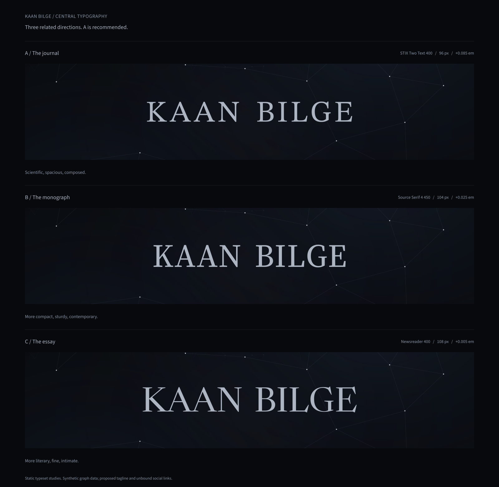
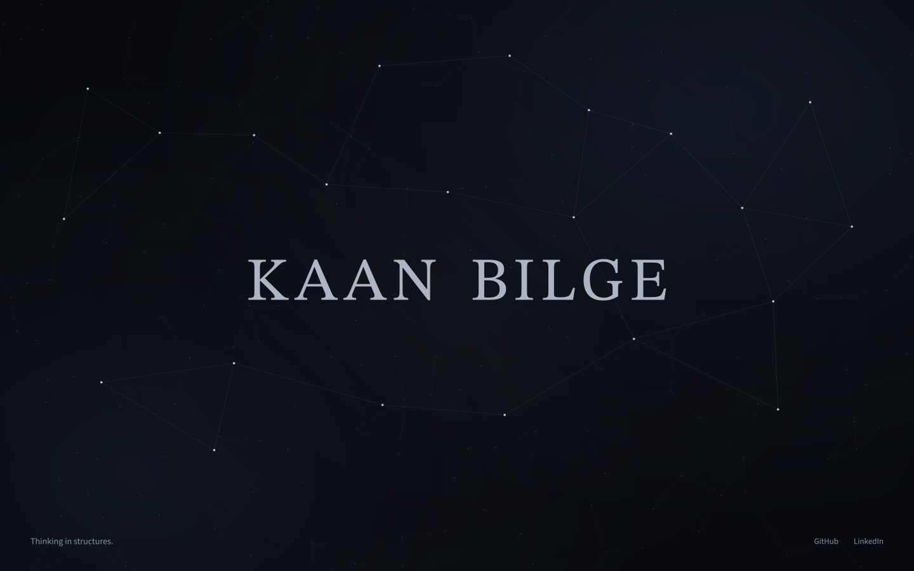
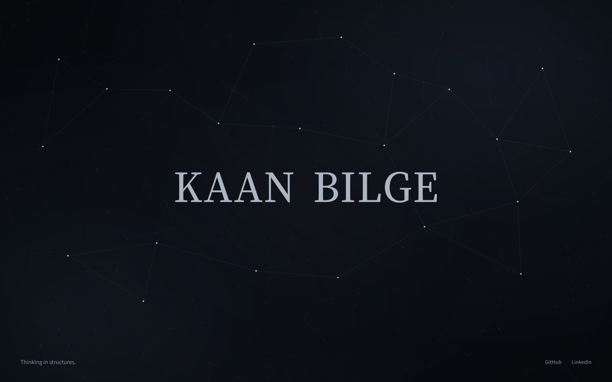
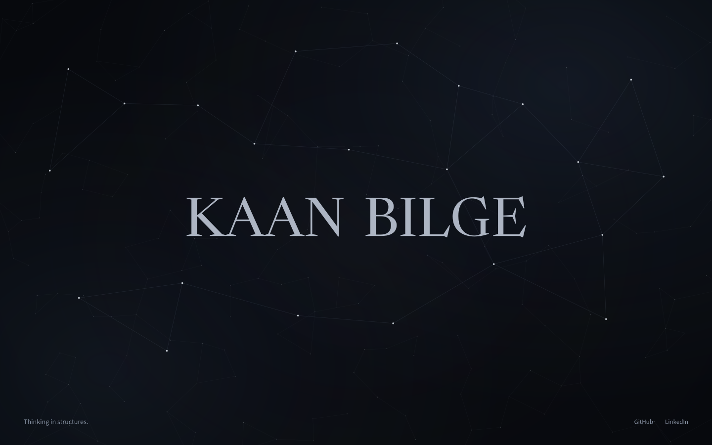
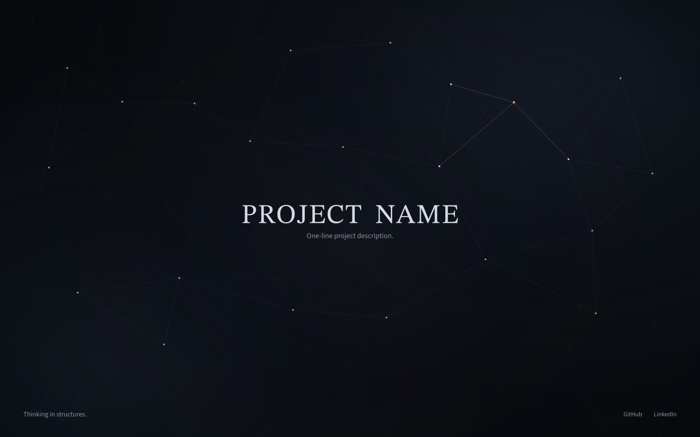
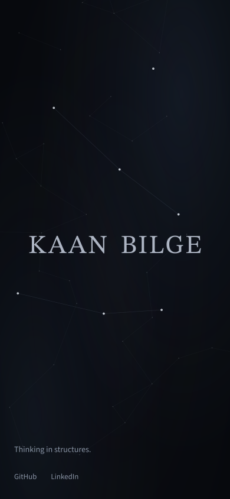

# Kaan Bilge — Three central typography treatments

These are three closely related treatments of the same composition. **A, The journal, is the recommended default.** The graph, palette, viewport, text anchor, peripheral copy, and interaction model are identical. Only the central serif treatment changes.

[Full-size comparison PNG](art-direction/visuals/typography-comparison.png) · [Scalable outlined SVG](art-direction/visuals/typography-comparison.svg)

The comparison’s labels and dividing rules belong to the design board, not the website. All lettering uses real font outlines. The graph is a synthetic composition specimen, not actual portfolio data. The tagline is proposed copy, social labels are unbound, and the hover specimen is explicitly placeholder content.

## A — The journal

**STIX Two Text, roman 400.** The widest letterspacing of the three, with sturdy bracketed serifs and a measured, open word shape. It has the strongest connection to a carefully typeset mathematics book. The personal name feels established without acquiring a logo symbol.

STIX’s scientific and technical publishing purpose is documented by the [STIX project](https://github.com/stipub/stixfonts) and [Tiro Typeworks](https://www.tiro.com/fonts/stix-two). The recommendation is an art-direction judgment: the typeface supplies enough mathematical character that the rest of the design can remain abstract and spare.

| Setting | Specification |
| --- | --- |
| Desktop name | 96 px; weight 400; line height 1.05; tracking +0.085 em; space-character advance 0.46 em. |
| Optical size | No optical-size axis. Do not synthesize one. |
| Rendered desktop advance width | Approximately **664 px**, at 1440 × 900. Capital height approximately 63 px. |
| Mobile name | 44 px; weight 400; tracking +0.055 em; same 0.46 em word space. Approximately 294 px wide at 390 px viewport width. |
| Project title | 56 px desktop / 30 px mobile; weight 400; tracking +0.035 em. |
| Scale anchors | 390: 44 px; 768: 64 px; 1440: 96 px; 1920: 108 px. |
| Character | Scientific, spacious, composed. |
| Guardrail | Do not increase tracking beyond +0.10 em or add engraved effects; it would become a ceremonial inscription. |

[Desktop PNG](art-direction/visuals/a-the-journal.png) · [Outlined SVG](art-direction/visuals/a-the-journal.svg)

## B — The monograph

**Source Serif 4, roman 450, optical size 32.** A taller, more compact name with less interletter air. The intermediate optical cut keeps its fine strokes more substantial than the full display cut. It feels like a contemporary technical author’s title page: a little closer to the reader, a little less ceremonial than A.

Adobe documents Source Serif 4’s optical-size family and its effect on proportions and details in [Source Serif gets optical sizes](https://blog.adobe.com/en/publish/2021/03/04/source-serif-gets-optical-sizes). The chosen optical-size value is deliberate; do not let automatic optical sizing silently switch this study to its 60-point display extreme.

| Setting | Specification |
| --- | --- |
| Desktop name | 104 px; weight 450; optical size 32; line height 1.04; tracking +0.025 em; space-character advance 0.38 em. |
| Rendered desktop advance width | Approximately **624 px**, at 1440 × 900. Capital height approximately 70 px. |
| Mobile name | 44 px; weight 450; optical size 24; tracking +0.015 em; space advance 0.38 em. |
| Project title | 58 px desktop / 30 px mobile; weight 450; optical size 32 desktop / 24 mobile; tracking +0.02 em. |
| Scale anchors | 390: 44 px; 768: 68 px; 1440: 104 px; 1920: 112 px. |
| Character | Compact, substantial, contemporary. |
| Guardrail | Keep the intermediate optical cut; extreme display contrast would make this too similar to C. Do not make it bold. |

[Desktop PNG](art-direction/visuals/b-the-monograph.png) · [Outlined SVG](art-direction/visuals/b-the-monograph.svg)

## C — The essay

**Newsreader, roman 400, optical size 72.** Broad, finely shaped capitals with almost neutral tracking. Its more expressive stroke rhythm is the most literary of the three. It makes the page feel like the work of a person who writes as well as builds, while staying within the same cold, precise composition.

Newsreader was designed by Production Type for reading on screens and includes optical sizes and expressive display cuts. [Production Type’s Newsreader page](https://productiontype.com/font/newsreader), [official source repository](https://github.com/productiontype/NewsReader).

| Setting | Specification |
| --- | --- |
| Desktop name | 108 px; weight 400; optical size 72; line height 1.03; tracking +0.005 em; space-character advance 0.34 em. |
| Rendered desktop advance width | Approximately **692 px**, at 1440 × 900. Capital height approximately 72 px. |
| Mobile name | 44 px; weight 400; optical size 32; tracking +0.005 em; space advance 0.34 em. |
| Project title | 60 px desktop / 30 px mobile; weight 400; optical size 48 desktop / 24 mobile; tracking +0.01 em. |
| Scale anchors | 390: 44 px; 768: 72 px; 1440: 108 px; 1920: 116 px. |
| Character | Literary, fine, personal. |
| Guardrail | No italics, extra-light weight, huge fashion-scale lettering, or amber typography. It must retain an authorial rather than luxury-brand character. |

[Desktop PNG](art-direction/visuals/c-the-essay.png) · [Outlined SVG](art-direction/visuals/c-the-essay.svg)

## Common fit and font rules

All variants retain identity silver `#ADB5C3`, preview silver `#D4DBE5`, the title’s 49%-height ink anchor, and Source Sans 3 for secondary information. Keep font kerning enabled. The word-space numbers refer to the space glyph’s advance; do not add an extra custom gap between two separately centered words.

Interpolate between each variant’s scale anchors and cap at its final size. At 360 px, use a 40 px name; at 320 px, use 36 px, reducing tracking if necessary. Long preview titles use the width limits and minimum sizes in DESIGN_DIRECTION.md. Keep the total name within the available width; never horizontally stretch the font.

Only one variant is used on the eventual site. Do not mix A for the name, B for hover, and C for a loading state. The typography is a persistent identity, not a font carousel.

The downloaded font builds used in these static proofs came from the corresponding [Google Fonts source directories](https://github.com/google/fonts/tree/main/ofl); the upstream projects document their licenses. No font installation or website asset bundle was created. These SVGs contain outlined display artwork, so the proofs remain viewable without fonts installed. The eventual site must use real selectable text and properly licensed font files, not these glyph paths as its interface.

## Recommended direction in two additional states

The hover proof changes the center into a project title and one-line description, with a single amber node and warm direct connections. It uses placeholder wording, not an invented Kaan project.

[Hover PNG](art-direction/visuals/a-the-journal-hover.png) · [Outlined SVG](art-direction/visuals/a-the-journal-hover.svg)

The 390 × 844 mobile proof preserves the complete centered name, the same atmosphere, fewer structural dots, and bottom-left support. It is a static responsive composition study; touch behavior is specified in INTERACTION_SPEC.md.

[Mobile PNG](art-direction/visuals/a-the-journal-mobile.png) · [Outlined SVG](art-direction/visuals/a-the-journal-mobile.svg)

The proofs establish the aesthetic. [DESIGN_DIRECTION.md](DESIGN_DIRECTION.md) and [INTERACTION_SPEC.md](INTERACTION_SPEC.md) establish responsive edge cases, real-data semantics, input behavior, and reduced-motion behavior. No website or interactive prototype has been implemented.
